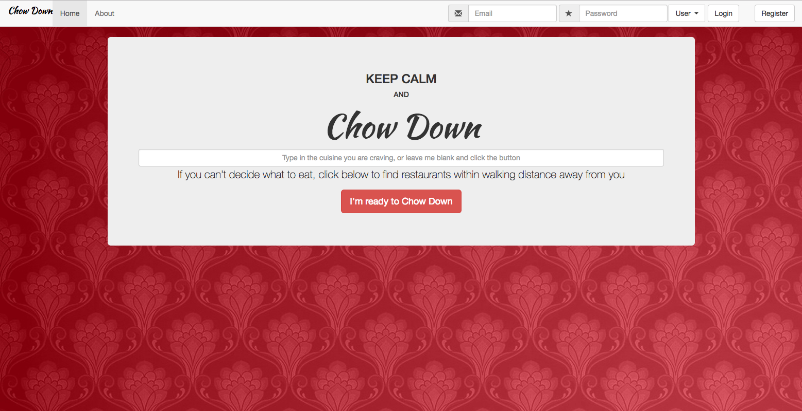
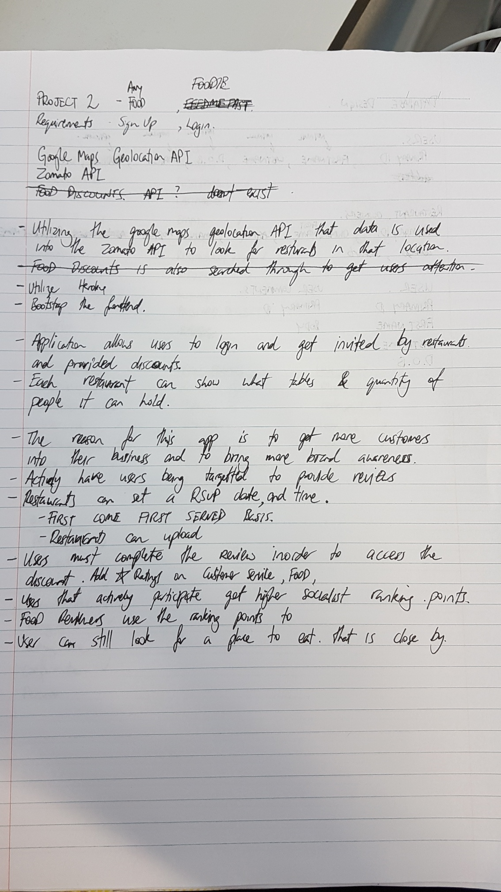
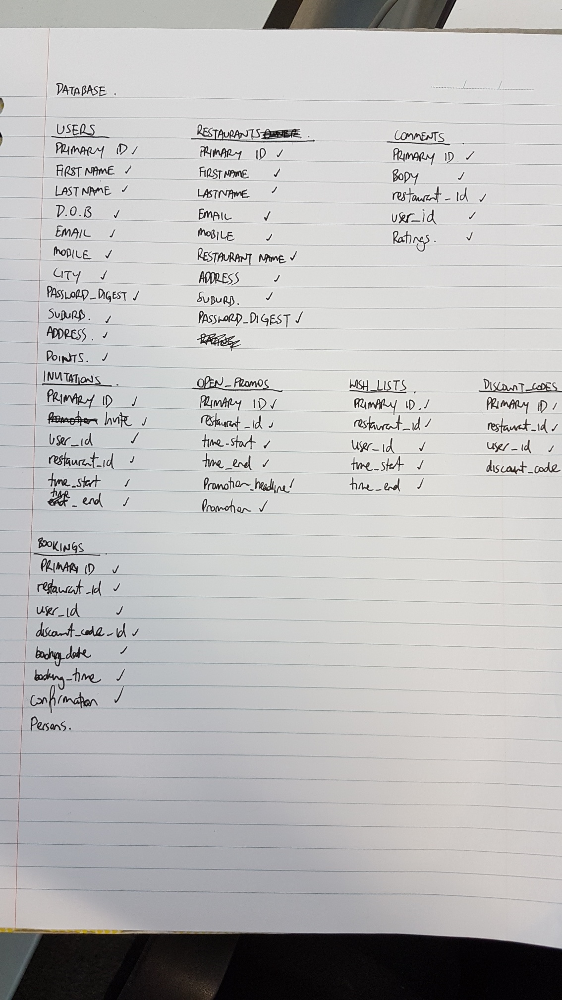
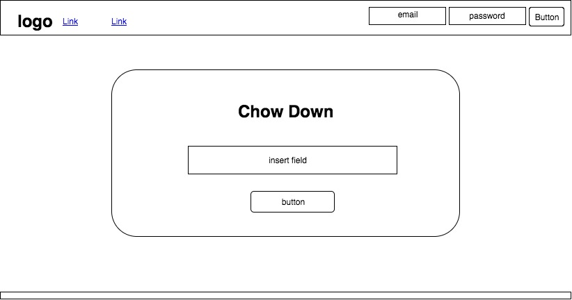
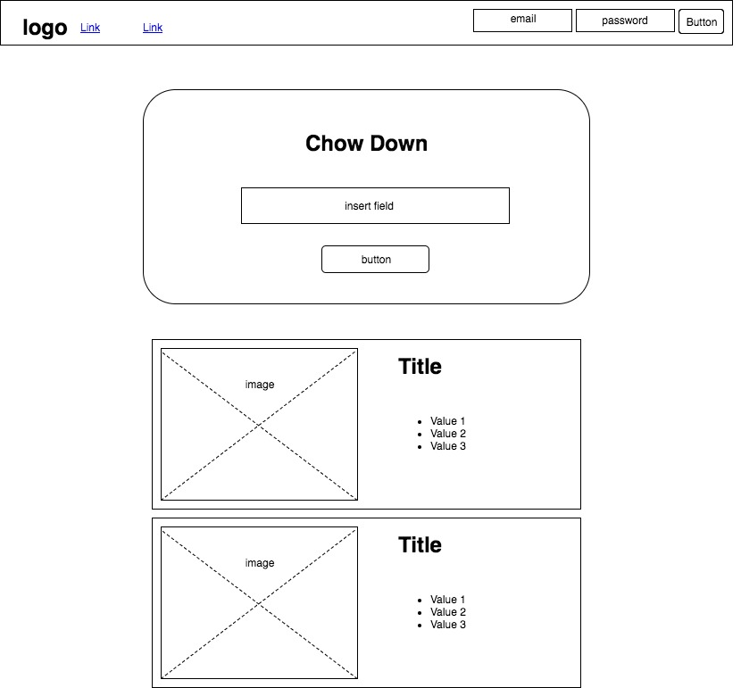

# Chow Down App

## Technologies
- HTML
- CSS
- Bootstrap
- Javascript
- Jquery
- Ruby
- Ruby on Rails
- PostgreSQL

Link to App on Heroku:

[Chow Down App](https://infinite-beach-40983.herokuapp.com)

## Introduction
> Chow Down is an app for foodies where users and restaurant owners can
form a community. People are becoming more accustomed to the
idea of reading food reviews and also supplying their own versions aswell.
My idea of creating a central point where restaurant owners can invite
amateur food reviewers or general hungry individuals to their restaurant with
an incentive such as discounts or freebies. In return the food reviewers must
provide a fair review of the restaurant based on these criterias:
- Customer Service,
- Food Quality,
- Atmosphere.

>Customer Service, Food Quality, and Atmosphere will be based on a score out of 10. The reason for the rating to be out of 10 instead of 5 is because it is far too easy to score a 4 and be rated as a top class restaurant. The scores will be averaged and a final score provided.

>I do believe that businesses want to drive their own successes more and individuals would also be keen to eat with incentives. As a social platform for foodies I do believe the main drivers for the success of this app will be the individual reviewers making it a vibrant place to share their restaurant experience

## Approach
> I took the first day of the project thinking through what type of app I would build to showcase a fullstack application and if there is something that I could see help local businesses. The main functionality of the app would have to work and that includes:
- Login and Registration for both restaurant owners and users,
- Make and delete bookings,
- Updating user and restaurant owner profiles,
- Search for restaurants or cafes surrounding the user with the Zomato API,
- Users commenting on restaurant,
- Working with Relational Database in PostgreSQL.

> Working within the time frame of 4.5 days there were more features I would have liked to add in, but the core of the app and it's own unique way of being able to personally invite individuals  and offer them discounts to try your restaurant and in return you are guaranteed a review of your business. I thought that businesses can reach new customers in a style that is more inviting than obtrusive advertising. This is where this app fits in.

Initial Brainstorm:

Thinking about the database:

Wireframe the idea:

Wireframe the search results:

## Installation Instructions
> Users of this application will not need to install any extra tools.

> For this App to work, it requires the person using it to run it with sharing location data. Otherwise the search for restaurants will not work. Everything else will work apart from that.

## Unsolved Problems
1. The search currently only works with cuisine or food types,
2. The search cannot look up different suburbs for food because it only searches in the immediate surrounding you are in. (special feature),
3. Checking for security leaks.

## Commercial Thinking
> The owner of the application could generate revenue from:
- Restaurants can purchase invitation slips for a low-cost fee. It is basically a replacement of current letterbox paper coupons,
- Restaurants that wish to advertise a site-wide promotion can have front index page space for a limited time or number of clicks,
- Users can earn points when they claim discount coupons from invitations where they can claim special titles and climb a leaderboard.

## Nice to have features to scale this app further
- Use google geolocation instead of the current HTML5 geolocation,
- Linking restaurants to their listings from the API and validate their ownership,
- Restaurant owners can advertise, upload their own images and take takeaway orders,
- Restaurant owners can reply to customers who have claimed the discounts and comments,
- Users can upload pictures of their experience.
